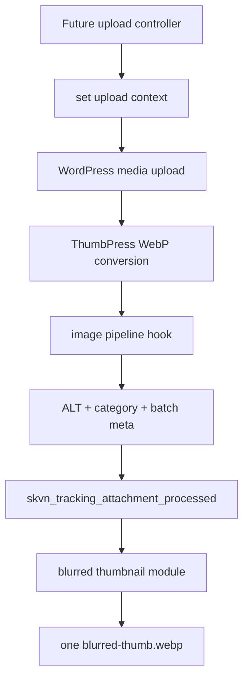
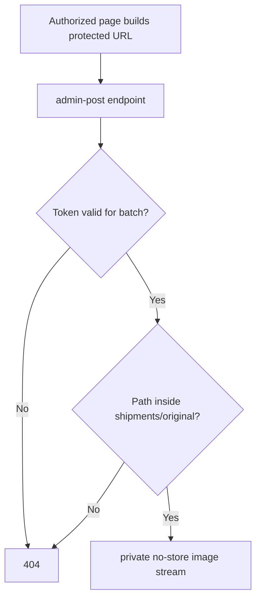

# Includes Module Map

## Purpose

Tài liệu này mô tả ownership và call flow của PHP runtime trong `includes/`.
Bootstrap `skvn-shipment-tracking.php` chỉ require file, gọi hàm register và
đăng ký activation/deactivation hooks.

Mọi public function dùng prefix `skvn_tracking_`.

## Runtime Map

```text
skvn-shipment-tracking.php
├── class-post-type.php
├── class-plugin-lifecycle.php
├── class-media-tabs.php
├── class-image-pipeline.php
│   └── do_action: skvn_tracking_attachment_processed
├── class-access-control.php
└── class-blurred-thumbnail.php
    └── listens: skvn_tracking_attachment_processed
```

Planned, chưa tồn tại:

```text
class-routing.php       0.4.0+
class-upload-portal.php 0.4.0+
```

## class-post-type.php

### Ownership

- Register CPT `skvn_shipment`.
- Define custom capability map.
- Register private batch meta.
- Provide sanitizers shared by other modules.

### Main Hooks

```text
init → skvn_tracking_register_post_type
init → skvn_tracking_register_post_meta
```

### Important Helpers

| Function | Contract |
|---|---|
| `skvn_tracking_meta_auth_callback()` | Private meta requires `manage_skvn_tracking` |
| `skvn_tracking_sanitize_date()` | Accept only `YYYY-MM-DD` |
| `skvn_tracking_sanitize_batch_status()` | Allow `draft`, `published`, `archived` |
| `skvn_tracking_sanitize_token()` | Allow lowercase 32-char hex |
| `skvn_tracking_sanitize_public_snapshot()` | Allow only public projection keys |

### Boundary

CPT remains `public: false`, `publicly_queryable: false`, `rewrite: false`.
Routing must not be added here.

## class-plugin-lifecycle.php

### Ownership

- Activation/deactivation behavior.
- Add `manage_skvn_tracking` to administrators.
- Create `uploads/shipments/`.
- Run non-destructive upgrade setup when plugin version changes.

### Main Hooks

```text
plugins_loaded → skvn_tracking_maybe_upgrade
activation     → skvn_tracking_activate
deactivation   → skvn_tracking_deactivate
```

### Boundary

- Deactivation does not remove capability or data.
- No destructive uninstall handler.
- Data purge requires a separate explicit admin action in a later milestone.

## class-media-tabs.php

### Ownership

- Add `Post - Pages` and `Shipment Tracking` controls to Media Library.
- Filter Grid AJAX by `_skvn_shipment_id`.
- Filter List view through `pre_get_posts`.
- Enqueue admin JS/CSS only on `upload.php`.

### Main Hooks

```text
admin_enqueue_scripts
ajax_query_attachments_args
pre_get_posts
```

### Boundary

`ajax_query_attachments_args` is global. It must not filter media modal requests
that do not contain `query.skvn_tracking_scope`.

Detailed decision:
`docs/decisions/00-media-library-tabs.md`.

## class-image-pipeline.php

### Ownership

- Hold request-scoped upload context.
- Route contextual uploads to
  `shipments/[batch-slug]/original/`.
- Protect original directory from static access where server supports it.
- Register attachment shipment/category meta.
- Normalize filenames and auto-detect category.
- Set `_skvn_shipment_id`, `_skvn_shipment_category` and ALT text.

### Main Hooks

```text
upload_dir
add_attachment priority 5
thumbpress_file_meta_refreshed priority 5
init → attachment meta registration
```

After successful processing:

```php
do_action(
    'skvn_tracking_attachment_processed',
    $attachment_id,
    $batch_id,
    $category
);
```

### Upload Context Contract

```php
skvn_tracking_set_upload_context( $batch_id, $category, $caption );

try {
    // WordPress media upload.
} finally {
    skvn_tracking_clear_upload_context();
}
```

The attachment hook must not read batch/category directly from a browser
request.

### Boundary

- Does not convert WebP.
- Does not generate token.
- Does not generate blurred thumbnail directly.
- ThumbPress timing tension remains OPEN until onsite verification.

## class-access-control.php

### Ownership

- Generate and backfill batch tokens.
- Rotate and validate tokens.
- Build protected attachment URLs.
- Stream original image after revalidating batch token.
- Record a client page view through an explicit helper.

### Main Hooks

```text
wp_after_insert_post → token generation
init                 → one-time token backfill
admin_post_skvn_tracking_file
admin_post_nopriv_skvn_tracking_file
```

### Security Flow

```text
attachment ID + token
→ validate attachment
→ resolve _skvn_shipment_id
→ validate shipment CPT
→ sanitize token
→ hash_equals stored token
→ verify realpath is inside shipments/*/original/
→ stream image with private, no-store
```

Invalid access returns `404`, not partial metadata or a different file.

`skvn_tracking_record_client_view()` is called once by the future client page
controller. It must not be called for every image request.

### Boundary

- Does not render client/public pages.
- Does not put tokens into public data.
- Share button and share popup remain later milestones.

## class-blurred-thumbnail.php

### Ownership

- Select source attachment.
- Generate one real server-blurred WebP.
- Store output path and source attachment ID.
- Provide the public blurred thumbnail URL helper.

### Main Hook

```text
skvn_tracking_attachment_processed
→ skvn_tracking_update_blurred_thumbnail
```

### Source Priority

```text
first Seal & Door attachment
→ fallback first attachment in batch
```

If a Seal attachment arrives after a fallback source, the same output file is
regenerated from the Seal source.

### Backend

```text
GD WebP
→ Imagick fallback
→ log warning and do not mark success
```

Output:

```text
shipments/[batch-slug]/blurred-thumb.webp
```

CSS blur is visual enhancement only. Privacy depends on the file being blurred
server-side.

## Call Flows

### Shipment Upload



### Private Original Request



## Adding a New Includes Module

1. Create `includes/class-<module>.php`.
2. Use only `skvn_tracking_` public function names.
3. Add a single register function when the module owns hooks.
4. Require and register it in `skvn-shipment-tracking.php`.
5. Document ownership and boundary in this file.
6. Confirm the deploy artifact contains the new include.
7. Run PHP lint, prefix scan, context consistency and package audit.

