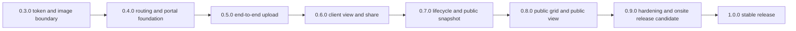

# Release Roadmap to 1.0.0

## Status

Proposed from Fact V2. This document does not promote the current milestone.

Current runtime baseline:

```text
0.3.0
├── CPT and private meta
├── Media Library scope
├── shipment upload context and attachment pipeline
├── token lifecycle and protected original stream
└── one server-blurred thumbnail per batch
```

Target for `1.0.0`:

```text
Staff can create a shipment batch and upload categorized photos
→ plugin returns a private client URL
→ staff can copy/share that URL
→ client can view authorized full-resolution photos
→ public visitors only receive stored redacted data and blurred imagery
```

## Planning Principles

1. Deliver the operations path before the SEO path.
2. Keep every private surface non-cacheable and `NOINDEX`.
3. Do not expose direct attachment URLs; client images use the protected stream.
4. Public code reads `_skvn_public_snapshot` only.
5. Keep batches `draft` after partial upload failure.
6. Use Vanilla TypeScript; no React or frontend framework runtime.
7. Keep mobile upload outside the 1.0 MVP as required by Fact V2.
8. Do not make 1.0 depend on email, n8n, a custom Gutenberg block, or data purge.
9. MVP tokens do not expire automatically; staff rotation revokes an old link.

## Critical Path



The operational goal is usable at `0.6.0`. Releases `0.7.0` and `0.8.0`
complete the public/privacy and SEO contracts before the stable release.

## 0.4.0 - Routing and Upload Portal Foundation

### Goal

Create the shared `/tracking/*` routing layer and a complete desktop upload UI
that can be connected to real upload endpoints without rewriting its state
model.

### Scope

- Add routing for:
  - `/tracking/upload/`
  - `/tracking/[slug]/`
- Apply `NOINDEX` to both routes.
- Apply private/no-store headers to `/tracking/upload/`.
- Render the inline WordPress login form when staff is logged out.
- Render the staff form shell, nonce and authorized configuration when logged in.
- Implement the light desktop UI with four zones.
- Implement typed shared state, picker, drag/drop, preview, remove, duplicate
  detection, cross-zone reassignment, counters and per-file errors.
- Define versioned request/response schemas for draft creation and file upload.
- Add the TypeScript entrypoint and build output for the upload portal.
- Do not simulate upload progress.
- Do not implement the draft/upload endpoints yet; `0.4.0` defines their
  contracts and keeps network submission disabled.

### Acceptance

- Logged-out visitors cannot receive portal configuration or nonce data.
- Logged-in staff with `manage_skvn_tracking` can open the form.
- Metadata and file validation are usable before network submission.
- Manual zone assignment remains authoritative.
- Object URLs are revoked on remove/reset/teardown.
- Upload submit remains unavailable until at least one valid file exists.
- TypeScript strict typecheck and deploy artifact audit pass.

### Main Modules

```text
includes/class-routing.php
includes/class-upload-portal.php
src/upload-portal/*
assets/css/upload-portal.css
```

## 0.5.0 - End-to-End Upload Pipeline

### Goal

Turn the portal into a working batch creation workflow and produce a valid
private client URL after successful upload.

### Scope

- Add authenticated draft creation endpoint.
- Add authenticated per-file upload endpoint with real XHR progress.
- Revalidate capability, nonce, MIME, extension, size and batch ownership.
- Sanitize and persist all batch metadata.
- Route uploads through WordPress media handling and the existing shipment
  upload context.
- Return attachment IDs and structured per-file errors.
- Support retry without re-uploading successful files.
- Keep partial failures in `draft`.
- On success, return:

```text
/tracking/[slug]/?token=<32-char-token>
```

- Render a minimal authorized client result page so the redirect is never a
  dead end. Full gallery UX remains `0.6.0`.
- Do not render the Share button or copy popup yet. In `0.5.0`, the valid URL is
  an integration result; the complete staff sharing workflow begins in `0.6.0`.

### Acceptance

- A batch cannot be created without at least one valid image.
- All successful attachments have shipment and category meta.
- Manual categories override filename detection.
- Originals resolve only through the protected endpoint.
- Exactly one blurred thumbnail exists per batch.
- Partial failure retains successful uploads and exposes retryable errors.
- Double submit is blocked.
- ThumbPress upload timing is verified onsite with real images.

### Main Modules

```text
includes/class-upload-controller.php
src/upload-portal/SubmitPipeline.ts
```

## 0.6.0 - Client View and Staff Share Workflow

### Goal

Complete the operation loop: upload, inspect, copy a link, and let a client view
the authorized shipment photos.

### Scope

- Validate token before reading private batch meta.
- Redirect missing/invalid token requests to the public view route.
- Send `NOINDEX`, private and no-store headers.
- Render private metadata and category navigation.
- Build protected image URLs server-side.
- Implement category switching and lazy image loading.
- Implement cross-category lightbox:
  - previous/next controls
  - Left/Right keyboard navigation
  - Escape close
  - simple zoom in/out
  - focus management
- Record `_skvn_last_viewed` and `_skvn_view_count` once per valid page request,
  not per image request.
- Server-render the Share button only for authorized staff.
- Implement the copy-link popup in Vanilla TypeScript.

### Acceptance

- Client HTML and JS state contain no static original attachment URL.
- The Share button is absent from the DOM for logged-out clients.
- Invalid tokens reveal no private metadata and no private file response.
- Rotating a token invalidates the old client URL immediately.
- A client can navigate the full batch without eagerly loading all originals.
- Client-page tracking increments once per valid page view.

### Main Modules

```text
includes/class-client-view.php
includes/class-share.php
src/lightbox/LightboxController.ts
src/share/SharePopup.ts
```

## 0.7.0 - Batch Lifecycle, Admin Operations and Public Projection

### Goal

Make batches operable after upload and establish the only data source allowed
for public rendering.

### Scope

- Implement `draft`, `published` and `archived` operations.
- Generate/backfill `_skvn_public_snapshot` for batches created before this
  milestone.
- Regenerate `_skvn_public_snapshot` when a public-safe source field or blurred
  thumbnail changes.
- Never fall back to private meta when the snapshot is missing or invalid.
- Store only this allowlisted projection:

```text
title
product_type
client_name       = "Redacted"
container_number  = "Redacted"
closing_year
thumb_url
contact_url       = "/contact/"
```

- Add default CPT admin list columns:
  - batch
  - product type
  - year
  - status
  - copy link
  - last viewed and count
  - created date
- Add token rotation action with capability and nonce checks.
- Keep archived token links working while excluding archived batches publicly.
- Keep destructive purge and email sharing outside scope.

### Acceptance

- Only `published` batches are public-query candidates.
- Draft and archived batches never appear in public collections.
- Existing valid batches can be backfilled without loading private data during
  a public request.
- Public snapshot contains no raw client name, raw container number, full
  closing date or token.
- Copy Link does not print the raw token as visible admin-list text.
- Admin actions require `manage_skvn_tracking`.

### Main Modules

```text
includes/class-batch-lifecycle.php
includes/class-public-snapshot.php
includes/class-admin-list.php
```

## 0.8.0 - Public Grid and Public View

### Goal

Complete the SEO surface without weakening the private-image boundary.

### Scope

- Provide the hybrid `/tracking/` page template:
  - Gutenberg editorial content first
  - shipment grid appended by the plugin
- Render the initial grid server-side from `_skvn_public_snapshot`.
- Add public REST pagination:

```text
GET /wp-json/skvn-tracking/v1/batches?page=2&per_page=12
```

- Implement the explicit `Load more` button; no automatic infinite scroll.
- Render skeleton, empty and end-of-list states.
- Cache `/tracking/`.
- Render `/tracking/[slug]/` from snapshot data and blurred imagery only.
- Cache the public batch view but keep it `NOINDEX`.
- Redirect public card and image interactions to `/contact/`.
- Do not add a public lightbox or share control.

### Acceptance

- `/tracking/` is the only indexable tracking surface.
- REST responses serialize only allowlisted snapshot fields.
- Missing/invalid snapshots produce a safe empty state and warning, never a
  private-meta fallback.
- Grid sorting is chronological, newest first.
- Pagination uses `Load more` and stops cleanly at the end.
- Public markup, preload data and JS state contain no private metadata.

### Main Modules

```text
includes/class-public-grid.php
includes/class-public-view.php
includes/class-rest-api.php
templates/skvn-tracking-grid.php
src/public-grid/LoadMore.ts
```

## 0.9.0 - Hardening and Onsite Release Candidate

### Goal

Verify the full workflow on the real WordPress/ThumbPress/cache stack and close
release-blocking failures.

### Scope

- Verify rewrite rules immediately after activation.
- Verify cache bypass for token and upload URLs in the onsite cache stack.
- Verify ThumbPress hook order and WebP attachment behavior.
- Verify GD or Imagick can generate the blurred WebP.
- Test upload validation, duplicate handling, progress, retry and partial
  failure.
- Test token rotation, invalid-token redirects and protected file responses.
- Test lightbox keyboard/focus behavior and lazy loading.
- Test public snapshot leakage boundaries in HTML, REST and page source.
- Test current desktop breakpoints and basic narrow-screen readability.
- Audit PHP 8.0 compatibility, JavaScript console and PHP logs.
- Audit the packaged ZIP rather than the source tree only.

### Exit Gate

No unresolved high-severity issue in:

```text
authorization
cache isolation
private file access
public data projection
upload data integrity
ThumbPress integration
```

## 1.0.0 - Stable Release

### Required Outcomes

- Staff can sign in inline, create a valid batch and upload photos.
- Staff can recover from per-file upload failures without losing successful
  files.
- Staff is redirected to the private client URL after success.
- Staff can inspect the client gallery and copy the share link.
- A client with a valid token can view authorized full-resolution images.
- A client without a valid token cannot obtain private metadata or originals.
- Public grid/view use stored redacted snapshots and blurred imagery only.
- Lifecycle, token rotation, admin list and view tracking are operational.
- Activation, deactivation and packaging are verified onsite.

### Explicitly Deferred After 1.0

- Mobile-specific upload portal.
- Custom Gutenberg grid block.
- Email integration.
- n8n automation.
- Chunked/resumable/background upload.
- Destructive data purge UI.
- Self-contained Tailwind migration away from WindPress.

## Changes Required in the Existing Backlog

After human approval, `.context/MILESTONE_ROADMAP.md` should be regenerated or
updated to reflect:

1. Split the current oversized `0.4.0` into portal foundation and real upload.
2. Move the client operational path ahead of the public SEO surfaces.
3. Replace every `infinite scroll` reference with explicit `Load more`.
4. Remove mobile upload from the `1.0.0` release gate.
5. Add `0.7.0`, `0.8.0` and `0.9.0` as lifecycle/public/release-candidate gates.

## Release Blockers Carried Forward

These do not prevent planning or writing isolated modules, but they block the
corresponding release gate:

| Blocker | Must be resolved by |
|---|---|
| ThumbPress hook/timing verified onsite | `0.5.0` |
| GD or Imagick blurred WebP verified onsite | `0.5.0` |
| Upload/token route cache exclusions verified onsite | `0.6.0` |
| Public REST response leakage audit | `0.8.0` |
| Full packaged workflow test | `0.9.0` |

## Approval Point

Human approval is required before this proposal replaces the backlog or
promotes `0.4.0`.
