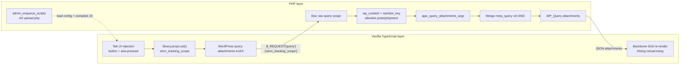
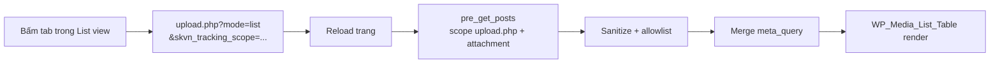

# 00 — Media Library Tabs

## Trạng thái

Accepted cho milestone `0.1.0`.

Decision này tổng hợp thiết kế ban đầu và các điều chỉnh sau khi kiểm tra source
WordPress Media Library.

## Mục tiêu

Thêm hai bộ lọc vào `/wp-admin/upload.php`:

```text
[ Post - Pages ] [ Shipment Tracking ]
```

| Scope gửi từ browser | Attachment được hiển thị |
|---|---|
| `posts` | Không có meta `_skvn_shipment_id` |
| `shipment` | Có meta `_skvn_shipment_id` |

`Post - Pages` là scope mặc định.

Browser chỉ được gửi enum `posts|shipment`. Meta key và phép so sánh luôn do PHP
quyết định; client không được gửi meta key tùy ý.

## Thiết kế tổng thể



Thứ tự bắt buộc:

```text
raw request
→ wp_unslash
→ sanitize_key
→ allowlist posts|shipment
→ resolve meta clause
→ merge meta_query
→ WP_Query
```

Không merge query trước khi sanitize.

## Grid View — Luồng chính

Grid view của WordPress dùng Backbone collection và endpoint
`query-attachments`.

1. PHP enqueue compiled TypeScript và CSS khi `$hook_suffix === 'upload.php'`.
2. PHP truyền `initialScope`, `queryKey` và labels cho script.
3. Trước khi WordPress tạo Grid, script thêm scope vào
   `_wpMediaGridSettings.queryVars`.
4. Script đợi event `wp-media-grid-ready`; nếu frame đã tồn tại thì lấy
   `wp.media.frames.browse`.
5. Khi bấm tab, script gọi:

```ts
library.props.set('skvn_tracking_scope', scope);
```

6. Backbone tự gửi AJAX mới và render lại Grid, không reload trang.
7. URL được đồng bộ bằng `history.replaceState` để refresh trang vẫn giữ scope.

Các state do WordPress quản lý như search, MIME type, date, ordering và
pagination không được reset khi đổi tab.

### Raw request quan trọng

Custom collection prop được gửi trong:

```php
$_REQUEST['query']['skvn_tracking_scope']
```

WordPress loại custom key khỏi `$query` trước khi gọi
`ajax_query_attachments_args`, nhưng raw `$_REQUEST['query']` vẫn còn. Vì vậy
PHP đọc scope từ raw request, sanitize, rồi tự thêm `meta_query`.

Không cần custom REST endpoint hoặc custom AJAX action.

## PHP Query Contract

Scope `shipment`:

```php
array(
    'key'     => '_skvn_shipment_id',
    'compare' => 'EXISTS',
)
```

Scope `posts`:

```php
array(
    'key'     => '_skvn_shipment_id',
    'compare' => 'NOT EXISTS',
)
```

Nếu query đã có `meta_query`, không overwrite. Query mới phải giữ clauses cũ:

```php
array(
    'relation' => 'AND',
    $existing_meta_query,
    $shipment_scope_clause,
)
```

## Boundary với Media Modal khác

`ajax_query_attachments_args` là hook global, được dùng cả trong Media Library
và media modal của editor.

PHP chỉ áp dụng filter khi raw AJAX request có
`query.skvn_tracking_scope`. Request không có plugin scope phải được trả lại
nguyên vẹn.

Nếu bỏ guard này, tab mặc định `posts` có thể vô tình giấu shipment attachments
trong media modal ở các admin screen khác.

## List View — Fallback

List view dùng `WP_Media_List_Table`, render bằng PHP, không dùng Backbone Grid.



Quyết định:

- Grid view chuyển tab không reload.
- List view dùng link/reload và `pre_get_posts`.
- Không xây custom AJAX replacement cho `WP_Media_List_Table` trong `0.1.0`.

Do đó acceptance “tab switch không reload” chỉ áp dụng cho Grid view.

## UI Contract

- Dùng native `<button type="button">`.
- Nhóm button dùng `role="group"` và `aria-label`.
- Active state dùng `aria-pressed="true"` và class `is-active`.
- Không dùng ARIA `tab`/`tabpanel` vì đây là filter của cùng một Grid, không
  phải các panel nội dung độc lập.
- DOM selector phải scope trong `#wp-media-grid` hoặc Media Library `.wrap`.
- Selector chèn UI hiện dựa vào `.wp-header-end`; phải smoke test sau mỗi lần
  update WordPress core.
- Không React, JSX hoặc UI framework runtime.

## Security và Scope

- Chỉ enqueue trên `upload.php`.
- User phải có capability `upload_files`.
- Input đi qua `wp_unslash()` và `sanitize_key()`.
- Chỉ chấp nhận `posts` hoặc `shipment`; giá trị khác fallback về `posts`.
- Không nhận meta key hoặc comparison từ client.
- Không thay đổi query attachment AJAX không có plugin scope.
- Không sửa WordPress core hoặc Thumbpress internals.

## File Map

| File | Trách nhiệm |
|---|---|
| `skvn-shipment-tracking.php` | Plugin bootstrap |
| `includes/class-media-tabs.php` | Enqueue, sanitize, Grid/List query filters |
| `src/admin-media-tabs.ts` | UI, Backbone collection props, URL state |
| `assets/js/admin-media-tabs.js` | JavaScript đã compile để deploy |
| `assets/css/admin-media-tabs.css` | Style scoped cho controls |

## Rủi ro đã chấp nhận

1. WordPress có thể thay markup hoặc Backbone Media Grid internals.
2. `EXISTS`/`NOT EXISTS` trên `postmeta` có thể chậm nếu Media Library cực lớn;
   quy mô hiện tại chấp nhận được.
3. Attachment vừa được gán hoặc xóa `_skvn_shipment_id` phải xuất hiện đúng
   scope ở lần query kế tiếp.
4. Grid và List là hai implementation khác nhau nên không có cùng behavior
   reload.

## Onsite Verification

Không chạy browser/runtime test offline. Khi upload lên site, kiểm tra:

- Grid mặc định mở `Post - Pages`.
- `Post - Pages` không có attachment mang `_skvn_shipment_id`.
- `Shipment Tracking` chỉ có attachment mang `_skvn_shipment_id`.
- Chuyển tab Grid không reload trang.
- URL cập nhật và refresh vẫn giữ đúng scope.
- Search, date, MIME filter và pagination còn hoạt động sau khi đổi scope.
- List view reload và giữ đúng scope.
- Media modal trên editor/admin screen khác không bị filter.
- Script/style không enqueue ngoài `upload.php`.
- Browser console không có JavaScript error.

